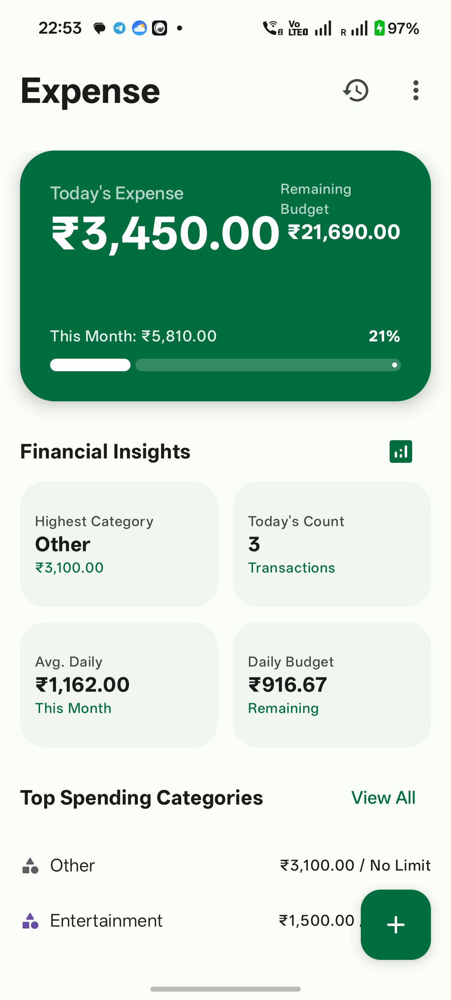
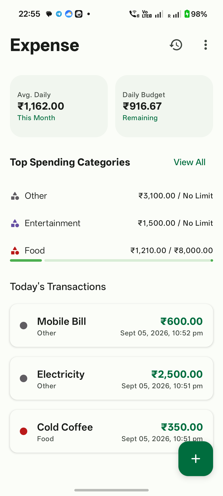
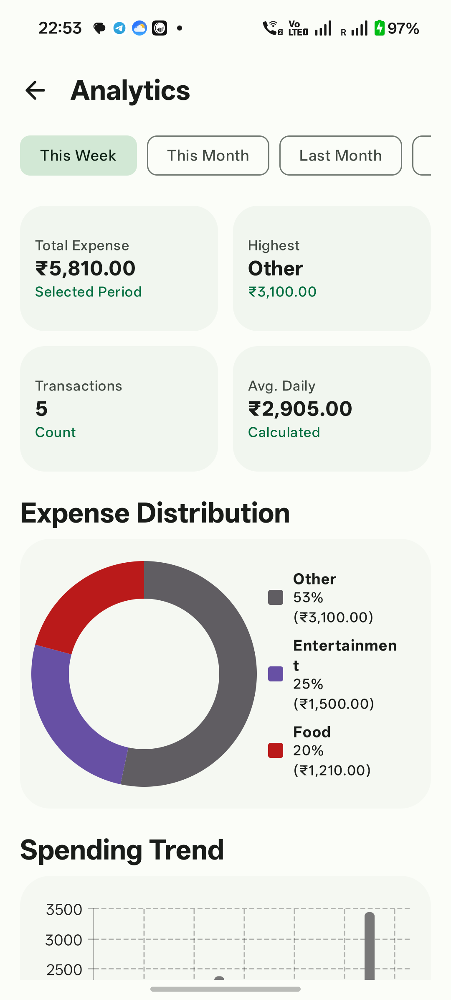
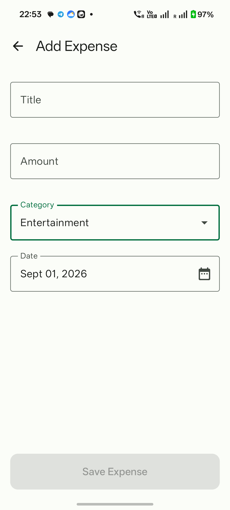
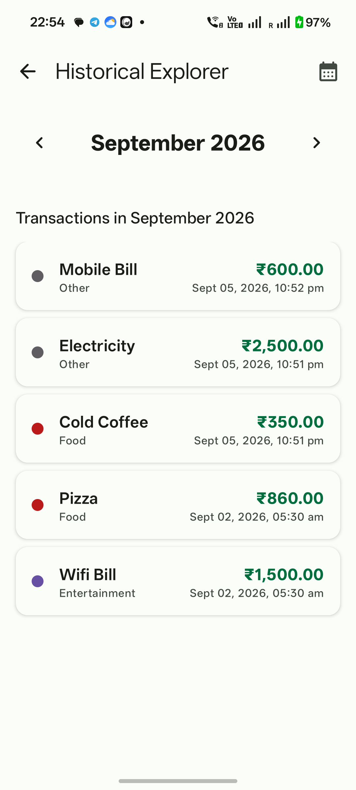
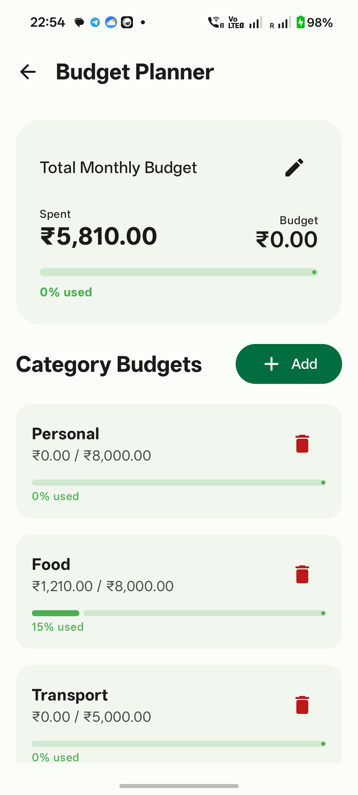
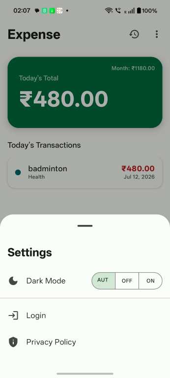
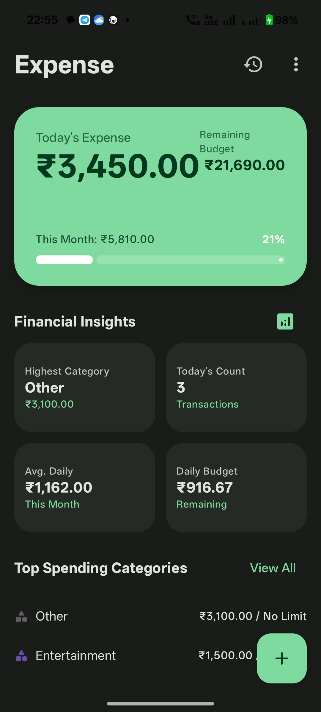
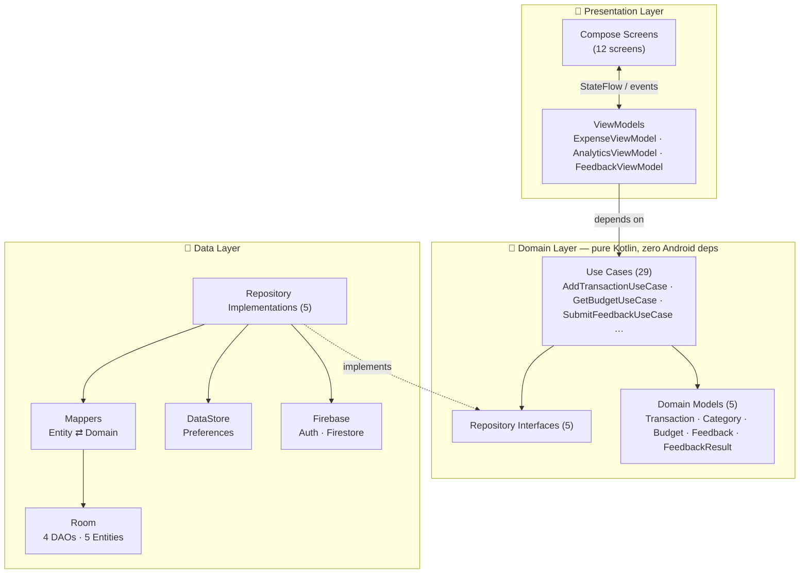

# 💰 Expense — Personal Expense Tracker

A modern, offline-first personal expense tracker for Android, built entirely with **Jetpack Compose** and structured around **Clean Architecture + MVVM**, with **Hilt** dependency injection, **Room** persistence, **Firebase** cloud sync, and unit tests across the domain and presentation layers.

<p align="left">
  
  
  
  
  
  
</p>

---

## 📱 Screenshots

| Dashboard | Financial Insights | Analytics | Add Expense |
|:---:|:---:|:---:|:---:|
|  |  |  |  |
| Today's spend, budget progress and insight cards | Top spending categories with per-category budget bars | Donut distribution + spending trend chart | Material 3 form with date picker |

| Historical Explorer | Budget Planner | Settings | Dark Theme |
|:---:|:---:|:---:|:---:|
|  |  |  |  |
| Month / date filtered history | Monthly + per-category budgets | Theme mode, sign-in and privacy in a bottom sheet | Full dark mode support |

---

## ✨ Features

### Core
- **Today-focused dashboard** — today's spend, month-to-date total, remaining budget and a live progress bar
- **Financial insights** — highest spending category, transaction count, average daily spend, remaining daily budget
- **Add / edit expenses** — title, amount, category and a Material 3 `DatePicker`, with inline validation
- **Swipe gestures** — swipe right to edit, swipe left to delete (`SwipeToDismissBox`)
- **Historical Explorer** — browse by month or filter to a specific date, with a list-detail adaptive layout

### Budgeting
- **Monthly budget** with used/remaining tracking
- **Per-category budgets** with colour-coded progress (green → amber at 80% → red at 100%)
- Falls back to the **sum of category budgets** when no explicit monthly budget is set

### Analytics
- Filter by **This Week / This Month / Last Month**
- **Donut chart** of category distribution with percentage legend (drawn with Compose `Canvas`)
- **Bar chart** spending trend across the selected period

### Categories
- Create and delete custom categories (max 8), each with a distinct colour
- Sensible defaults seeded on first launch; the `Other` category is protected from deletion

### Notifications
- **Daily reminder** — nudges you if no expense was logged today
- **Daily summary** — reports the day's total spend
- **Budget alerts** — warns at 80% of budget and again when exceeded
- Per-notification time pickers, scheduled via **WorkManager** and re-scheduled after device reboot

### Security & Accounts
- **Google Sign-In** via Firebase Auth, plus a "Skip" path for fully local use
- **Biometric app lock** (fingerprint / face / device credential) held behind the splash screen so the UI never flashes before unlock
- **Firestore sync** — transactions, categories and budgets mirror to `users/{uid}/…` when signed in

### Write to CEO (Feedback)
A complete offline-capable feedback channel:
- Draft autosave every 30s plus an explicit *Save draft* action
- Local-first submission — the message is persisted **before** the network call, so nothing is lost if the process dies
- Offline queue with exponential backoff and automatic retry on next screen open
- Full status history: `DRAFT → PENDING → SENT / FAILED`

### Personalisation
- **Theme**: Auto / Light / Dark, persisted with DataStore
- **Font picker**: 6 typefaces applied app-wide from the `:core:font` module
- Edge-to-edge display and Material 3 light-green financial motif throughout

### Entry points
Beyond the launcher icon, the app is reachable via:
- **App-icon long-press shortcuts** — Add expense, Analytics, Write to CEO
- **Custom scheme deep links** — `expense://feedback`, `expense://add_expense`, `expense://analytics`, `expense://history`
- **Web deep links** — `https://<your-domain>/feedback`

All three shapes funnel through a single `AppDeepLinks.resolve()` resolver, and a pending destination is deliberately **held until the user clears the Lock/Login gate** — a deep link can never jump past authentication.

---

## 🏗 Architecture

The project follows **Clean Architecture** with three strictly separated layers, and **MVVM** in the presentation layer.



### The dependency rule

Dependencies point **inward only**. The domain layer is plain Kotlin — it imports no Android framework classes, no Room, no Firebase — which is exactly what makes the use cases trivially unit-testable with nothing but Mockito.

| Layer | Knows about | Never knows about |
|---|---|---|
| **Presentation** | Domain | Room, Firestore, DataStore |
| **Domain** | *nothing* | Everything else |
| **Data** | Domain | Presentation |

### Layer responsibilities

**Domain (`domain/`)** — The business core.
- `model/` — immutable `data class`es, `@Serializable` so they cross the Navigation 3 backstack
- `repository/` — contracts the data layer must fulfil, expressed as `Flow` and `suspend` functions
- `usecase/` — one class, one operation, invoked as a function via `operator fun invoke()`

```kotlin
class DeleteCategoryUseCase @Inject constructor(
    private val repository: CategoryRepository
) {
    suspend operator fun invoke(category: Category) {
        if (category.isRemovable) {          // ← business rule lives here, not in the ViewModel
            repository.deleteCategory(category)
        }
    }
}
```

**Data (`data/`)** — The implementation details.
- `local/entity/` + `local/dao/` + `local/db/` — Room, with a hand-written `MIGRATION_3_4` so existing users never lose their transactions
- `mapper/` — pure extension functions converting `Entity ⇄ Domain`
- `repository/` — **local-first** writes: persist to Room, then mirror to Firestore; network failures are logged, never surfaced as crashes

**Presentation (`ui/`)** — State and rendering.
- ViewModels expose `StateFlow`, produced with `stateIn(WhileSubscribed(5_000))` so collection stops shortly after the UI leaves the screen
- Screens are stateless composables reading state via `collectAsStateWithLifecycle()`
- One-shot outcomes (snackbars) travel over a `SharedFlow`, never a `StateFlow`

The dashboard is a good example of derived state — six independent flows folded into one immutable UI model:

```kotlin
val dashboardUiState: StateFlow<DashboardUiState> = combine(
    todayTransactions,
    todayTotalSpent,
    currentMonthTotalSpent,
    monthlyBudget,
    currentMonthSpendingByCategory,
    categoryBudgets
) { … }.stateIn(viewModelScope, SharingStarted.WhileSubscribed(5_000), DashboardUiState())
```

---

## 💉 Dependency Injection with Hilt

Everything is wired at the `SingletonComponent` level across three modules.

| Module | Provides |
|---|---|
| `di/DatabaseModule.kt` | `ExpenseDatabase` and its four DAOs (`TransactionDao`, `CategoryDao`, `BudgetDao`, `FeedbackDao`) |
| `di/FirebaseModule.kt` | `FirebaseAuth`, `FirebaseFirestore` |
| `di/RepositoryModule.kt` | The five repository implementations, bound to their **domain interfaces** |

```kotlin
@Module
@InstallIn(SingletonComponent::class)
object RepositoryModule {

    @Provides
    @Singleton
    fun provideTransactionRepository(
        dao: TransactionDao,
        firestore: FirebaseFirestore,
        auth: FirebaseAuth
    ): TransactionRepository = TransactionRepositoryImpl(dao, firestore, auth)   // ← returns the interface
}
```

Because the module returns the **interface**, every consumer above it — use cases, ViewModels — is compile-time incapable of reaching into the data layer. Swapping Room for anything else is a one-line change in one file.

Use cases need no module at all: they are `@Inject constructor` classes, so Hilt constructs them automatically.

### Hilt across the whole app

| Component | Annotation | Notes |
|---|---|---|
| `ExpenseApplication` | `@HiltAndroidApp` | Also implements `Configuration.Provider` for WorkManager |
| `MainActivity` | `@AndroidEntryPoint` | Extends `FragmentActivity` (required by `BiometricPrompt`) |
| `ExpenseViewModel`, `AnalyticsViewModel`, `FeedbackViewModel` | `@HiltViewModel` | Injected in Compose via `viewModel()` |
| `BootReceiver` | `@AndroidEntryPoint` | Injects `SettingsRepository` to reschedule alarms after reboot |
| `DailyReminderWorker`, `DailySummaryWorker` | `@HiltWorker` + `@AssistedInject` | Use cases injected straight into workers |

---

## 🧪 Testing

Unit tests live in `app/src/test/` and run on the JVM — no emulator required, because the domain layer has no Android dependencies to stub out.

**Stack:** JUnit 4 · Mockito + mockito-kotlin · `kotlinx-coroutines-test` · `androidx.test:core`

```bash
./gradlew :app:testDebugUnitTest
```

### Use-case tests

Use cases are the easiest thing in the codebase to test — a mock repository and a single assertion:

```kotlin
class AddTransactionUseCaseTest {

    @Mock private lateinit var repository: TransactionRepository
    private lateinit var addTransactionUseCase: AddTransactionUseCase

    @Before
    fun setUp() {
        MockitoAnnotations.openMocks(this)
        addTransactionUseCase = AddTransactionUseCase(repository)
    }

    @Test
    fun `invoke should call insertTransaction on repository`() = runTest {
        val transaction = Transaction(1, "Test", 10.0, "Test", 123456L)

        addTransactionUseCase(transaction)

        verify(repository).insertTransaction(transaction)
    }
}
```

### ViewModel tests

ViewModels are tested by mocking their use cases and swapping the main dispatcher for a `StandardTestDispatcher`:

```kotlin
@Before
fun setUp() {
    MockitoAnnotations.openMocks(this)
    Dispatchers.setMain(testDispatcher)
    viewModel = ExpenseViewModel(/* mocked use cases */)
}

@After
fun tearDown() = Dispatchers.resetMain()

@Test
fun `setSkippedLogin should call setLoginStatusUseCase`() = runTest {
    viewModel.setSkippedLogin(true)
    advanceUntilIdle()
    verify(setLoginStatusUseCase).invoke(true)
}
```

`ExpenseViewModelTest` covers 14 cases across transactions, categories, budgets, theme/font preferences, login state, logout and sync. Because six of the ViewModel's flows are built during property initialisation, the mocks for those are stubbed **before** construction:

```kotlin
whenever(getCategoriesUseCase()).thenReturn(flowOf(emptyList()))
whenever(getThemeModeUseCase()).thenReturn(flowOf(0))
whenever(settingsRepository.biometricEnabled).thenReturn(flowOf(false))
// … then construct the ViewModel
```

Instrumented tests (`app/src/androidTest/`) are configured with Espresso and `compose-ui-test-junit4` for UI testing.

---

## 🛠 Tech Stack

| Area | Technology |
|---|---|
| **Language** | Kotlin 2.2.10 |
| **UI** | Jetpack Compose · Material 3 · Material 3 Adaptive (`ListDetailPaneScaffold`) |
| **Architecture** | Clean Architecture · MVVM · Unidirectional data flow |
| **Navigation** | **Navigation 3** (`NavDisplay`, `rememberNavBackStack`, type-safe `@Serializable` destinations) |
| **DI** | Hilt 2.60.1 (KSP) |
| **Local storage** | Room 2.7 (with manual migrations) · DataStore Preferences |
| **Cloud** | Firebase Auth (Google Sign-In) · Cloud Firestore |
| **Async** | Coroutines · Flow · StateFlow / SharedFlow |
| **Background work** | WorkManager + `@HiltWorker` |
| **Security** | AndroidX Biometric |
| **Charts** | Compose `Canvas` (custom donut + bar charts) · Vico |
| **Images** | Coil |
| **Build** | Gradle 9.4 (Kotlin DSL) · Version Catalog · Configuration Cache |
| **Testing** | JUnit 4 · Mockito · coroutines-test · Espresso · Compose UI Test |

---

## 📂 Project Structure

```
Expense/
├── app/
│   └── src/main/java/com/icit/expense/
│       ├── ExpenseApplication.kt          # @HiltAndroidApp + WorkManager config
│       ├── MainActivity.kt                # Nav 3 host, theme, auth/lock gating
│       │
│       ├── domain/                        # ── Pure Kotlin, no Android imports ──
│       │   ├── model/                     # Transaction, Category, Budget, Feedback…
│       │   ├── repository/                # 5 repository interfaces
│       │   └── usecase/                   # 29 single-responsibility use cases
│       │
│       ├── data/                          # ── Implementation details ──
│       │   ├── local/
│       │   │   ├── entity/                # Room @Entity classes
│       │   │   ├── dao/                   # 4 DAOs
│       │   │   └── db/                    # ExpenseDatabase + migrations
│       │   ├── mapper/                    # Entity ⇄ Domain converters
│       │   └── repository/                # 5 repository implementations
│       │
│       ├── di/                            # ── Hilt modules ──
│       │   ├── DatabaseModule.kt
│       │   ├── FirebaseModule.kt
│       │   └── RepositoryModule.kt
│       │
│       ├── notification/                  # WorkManager workers, scheduler, BootReceiver
│       │
│       └── ui/                            # ── Presentation ──
│           ├── theme/                      # Colours, typography, ExpenseTheme
│           ├── NavDestinations.kt          # Type-safe Nav 3 destinations
│           ├── AppDeepLinks.kt             # Shortcut / deep-link resolver
│           ├── *ViewModel.kt               # 3 @HiltViewModels
│           └── *Screen.kt                  # 12 Compose screens
│
├── core/
│   └── font/                              # Reusable font/typography module
│
├── screens/                               # README screenshots
└── gradle/libs.versions.toml              # Version catalog
```

---

## 🚀 Getting Started

### Prerequisites
- Android Studio (latest stable)
- JDK 11+
- Android SDK 37
- A device or emulator running Android 10 (API 29) or higher

### Setup

**1. Clone**
```bash
git clone https://github.com/<your-username>/Expense.git
cd Expense
```

**2. Configure Firebase**

The app uses Firebase Auth and Firestore, so you'll need your own project:

1. Create a project at the [Firebase Console](https://console.firebase.google.com/)
2. Add an Android app with the package name `com.icit.expense`
3. Enable **Authentication → Google** as a sign-in provider
4. Create a **Cloud Firestore** database
5. Download `google-services.json` and drop it into `app/` — the repo ships [`app/google-services.json.example`](app/google-services.json.example) showing the expected shape, and the real file is git-ignored
6. Add your debug keystore's SHA-1 fingerprint to the Firebase project (required for Google Sign-In):

```bash
./gradlew signingReport
```

**3. Configure secrets**

No credentials live in source. Copy the example file and fill in your own value:

```bash
cp secrets.properties.example secrets.properties
```

```properties
WEB_CLIENT_ID=000000000000-YOUR_WEB_CLIENT.apps.googleusercontent.com
```

`secrets.properties` is git-ignored. Gradle reads it at configuration time and exposes the value as `BuildConfig.WEB_CLIENT_ID`:

```kotlin
// app/build.gradle.kts — read via the provider API so the configuration cache tracks the file
fun secret(key: String, default: String = ""): String =
    providers.fileContents(
        rootProject.layout.projectDirectory.file("secrets.properties")
    ).asText.map { text ->
        Properties().apply { load(text.reader()) }.getProperty(key) ?: default
    }.getOrElse(default)

defaultConfig {
    buildConfigField("String", "WEB_CLIENT_ID", "\"${secret("WEB_CLIENT_ID")}\"")
}
```

If the file is absent the build still succeeds with an empty value, and the login screen reports a clear configuration error instead of failing obscurely at the Google Sign-In call.

> Your Web Client ID is the `oauth_client` entry with `"client_type": 3` in `google-services.json`, also shown in **Firebase Console → Project settings → General → Web client ID**.

**4. Firestore security rules**

```js
rules_version = '2';
service cloud.firestore {
  match /databases/{database}/documents {

    // Each user's data is private to them
    match /users/{userId}/{document=**} {
      allow read, write: if request.auth != null && request.auth.uid == userId;
    }

    // Feedback: signed-in users may submit; nobody may read others' messages
    match /feedback/{messageId} {
      allow create: if request.auth != null;
      allow read, update, delete: if false;
    }
  }
}
```

**5. Build & run**
```bash
./gradlew :app:assembleDebug     # build
./gradlew :app:testDebugUnitTest # unit tests
./gradlew installDebug           # install on a connected device
```

> The app is fully usable without signing in — tap **SKIP** on the login screen and everything is stored locally in Room. Firebase is only required for cross-device sync and the feedback channel.

---

## 🎨 Design

Material 3 with a custom **light-green financial motif** (dynamic colour is deliberately disabled to keep branding consistent), complete light and dark palettes, and colour-coded categories:

| Category | Colour | | Category | Colour |
|---|---|---|---|---|
| Food | 🔴 `#BA1A1A` | | Entertainment | 🟣 `#6750A4` |
| Transport | 🔵 `#0061A4` | | Shopping | 🟠 `#924B00` |
| Health | 🩵 `#006A6A` | | Other | ⚫ `#605D62` |
| Sports | 🟢 `#8BC34A` | | | |

---

## 🗺 Roadmap

- [ ] Implement `CategoryRepositoryImpl.clearAllCategories()` (currently a no-op)
- [ ] Clear budgets on logout — `ClearLocalDataUseCase` doesn't yet call `BudgetRepository.clearLocalData()`
- [ ] Sync budgets from Firestore in `SyncUserDataUseCase` so they restore on a new device
- [ ] Enable Firebase Anonymous Auth so users who tapped *Skip* can also submit feedback
- [ ] Wire up the custom date range filter in Analytics
- [ ] Export transactions to CSV / PDF
- [ ] Recurring transactions
- [ ] Multi-currency support
- [ ] Home screen widget
- [ ] Expand test coverage across repositories and remaining ViewModels

---

## 🤝 Contributing

Issues and pull requests are welcome. If you're contributing code, please keep the layer boundaries intact — business rules belong in use cases, Android and framework types stay out of `domain/`.

---

## 📄 License

This project is available under the MIT License. See [`LICENSE`](LICENSE) for details.

---

<p align="center">Built with ❤️ using Kotlin and Jetpack Compose</p>
